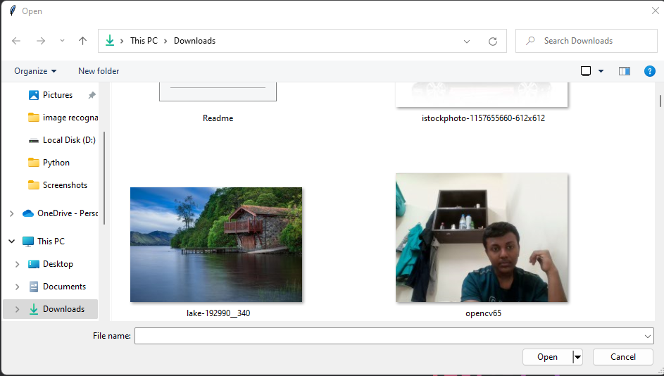
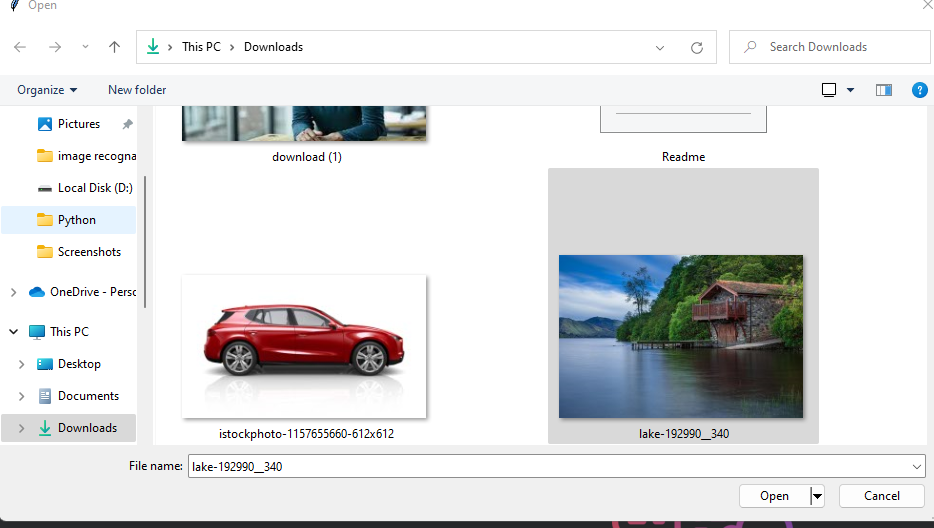
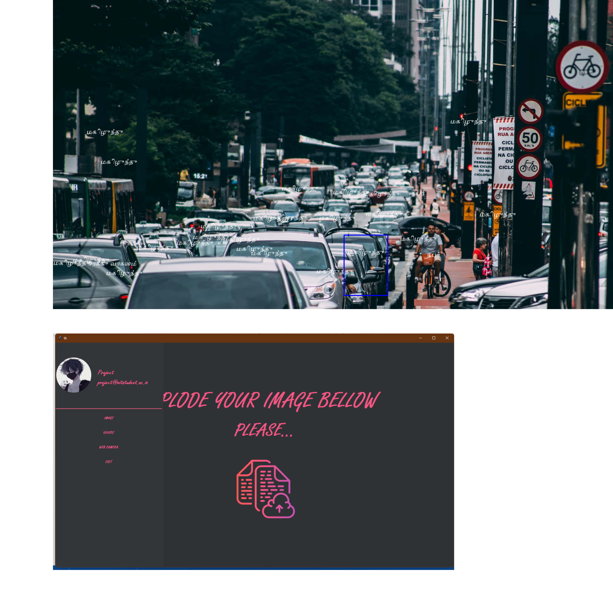

**User Manual**

> 1\. Run the project using Pixserve application

> 2\. Click on it
>
> Browse window appears

+-----------------------------------+-----------------------------------+
| 3\.                               | > Then select the image           |
+===================================+===================================+
+-----------------------------------+-----------------------------------+

> 
>
> 4\. A new window appears
>
> 
>
> 5\. When you need to check with other image press 'q' in keyboard
>
> 6\. Then upload another image

+-----------------------------------+-----------------------------------+
| 7\.                               | > You can also capture an image   |
|                                   | > through your webcam using left  |
| 8\.                               | > panel                           |
|                                   | >                                 |
|                                   | > Select Web camera it will turn  |
|                                   | > on your Web camera, capture the |
|                                   | > object.                         |
+===================================+===================================+
+-----------------------------------+-----------------------------------+
